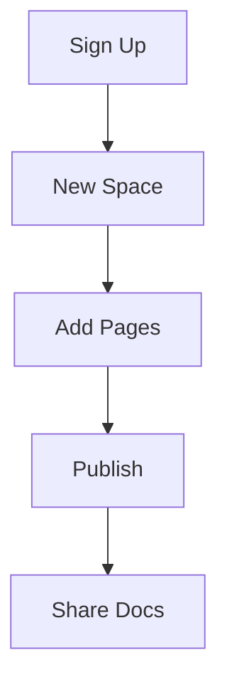

## Overview

Get started with haha Documentation in minutes. This guide walks you through account creation, project setup, dashboard navigation, and essential configuration tips. Organize your project docs efficiently with our intuitive interface.

## Create Your Account

Sign up using your preferred method. Choose from email registration or social logins for quick access.

<Tabs>
  <Tab title="Email" icon="mail">
    Visit `https://app.haha-docs.com/signup` and enter your email, password, and username.
    
    Verify your email to activate the account.
  </Tab>
  <Tab title="GitHub" icon="github">
    Click the GitHub button on the sign-up page.
    
    Authorize haha Documentation to access your profile.
  </Tab>
</Tabs>

<Callout kind="tip">
  Enable two-factor authentication immediately after sign-up for added security.
</Callout>

## Set Up Your First Project

Follow these steps to create your initial documentation space.

<Steps>
  <Step title="Create New Space" icon="plus">
    From the dashboard, click **New Space**.
    
    Enter a name like `My Project Docs` and select a template (e.g., "API Reference").
  </Step>
  <Step title="Add Pages" icon="file-text">
    Navigate to your space and click **New Page**.
    
    Choose a layout and start editing with our MDX editor.
  </Step>
  <Step title="Publish" icon="globe">
    Click **Publish** to make your docs live.
    
    Share the generated URL with your team.
  </Step>
</Steps>



## Navigate the Dashboard

The dashboard centralizes your spaces and tools. Use these key sections to manage your documentation.

<Columns cols={3}>
  <Card title="Spaces" icon="folder" href="/spaces">
    View and manage all your documentation spaces.
  </Card>
  <Card title="Templates" icon="layout" href="/templates">
    Browse pre-built templates for quick starts.
  </Card>
  <Card title="Settings" icon="settings" href="/settings">
    Configure themes, integrations, and permissions.
  </Card>
</Columns>

## Initial Configuration Tips

Customize your space for better usability.

<ExpandableGroup>
  <Expandable title="Set Brand Color" default-open="true">
    Go to **Space Settings > Theme**.
    
    Update the primary color to `#3B82F6` for your brand.
  </Expandable>
  <Expandable title="Add Custom Domain">
    In **Domain Settings**, enter `docs.yourproject.com`.
    
    Follow DNS instructions to verify ownership.
  </Expandable>
</ExpandableGroup>

<CodeGroup tabs="Frontmatter,Theme Config">
```yaml
---
title: My API Docs
description: Comprehensive API reference
theme:
  primaryColor: "#3B82F6"
---
```

```javascript
// theme.js config
export default {
  primaryColor: '#3B82F6',
  font: 'Inter'
};
```
</CodeGroup>

<Callout kind="success">
  Your first space is ready! Explore integrations next for advanced workflows.
</Callout>

<Columns cols={2}>
  <Card title="Next: API Integrations" icon="plug" href="/integrations">
    Connect GitHub, Slack, and more.
  </Card>
  <Card title="Customize Themes" icon="palette" href="/themes">
    Match your brand perfectly.
  </Card>
</Columns>