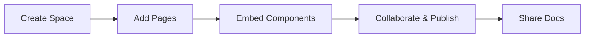

## Overview

haha Documentation provides a centralized platform where you create, organize, and publish project documentation. You build knowledge bases with rich MDX content, custom components, and seamless collaboration tools. This space helps teams maintain up-to-date docs without complex setups.

Whether you document APIs, user guides, or internal wikis, haha streamlines the process. You focus on content while the platform handles rendering, search, and versioning.

## Key Features

haha Documentation stands out with powerful features that enhance your workflow.

<Columns cols={3}>
  <Card title="Rich MDX Components" icon="components" href="/docs/components">
    Use built-in components like `<Callout>`, `<Steps>`, and `<Tabs>` to create interactive docs. No custom setup required.
  </Card>
  <Card title="Real-Time Collaboration" icon="users" href="/docs/collaboration">
    Edit docs together with multiple users. Track changes and resolve conflicts effortlessly.
  </Card>
  <Card title="Version Control" icon="git-branch" href="/docs/versioning">
    Maintain doc history with Git integration. Roll back changes or branch for experiments.
  </Card>
</Columns>

<Callout kind="info">
  All features integrate with your existing tools. Start with a free tier to test them.
</Callout>

## Getting Started

Set up your first documentation space in minutes. Follow these steps to create and publish content.

<Steps>
  <Step title="Create Your Space" icon="plus">
    Sign up at `https://app.haha-docs.com` and create a new documentation space. Choose a name like `my-project-docs`.
  </Step>
  <Step title="Add Your First Page" icon="file-text">
    Navigate to your space and click "New Page". Use the MDX editor to add content.
  </Step>
  <Step title="Embed Code Examples" icon="code">
    Insert multi-language examples with `<CodeGroup>`. Here's how:

    <CodeGroup tabs="JavaScript,Python">
      ```javascript
      // Fetch project data
      const response = await fetch('https://api.haha-docs.com/projects');
      const projects = await response.json();
      console.log(projects);
      ```
      ```python
      # Fetch project data
      import requests
      response = requests.get('https://api.haha-docs.com/projects')
      projects = response.json()
      print(projects)
      ```
    </CodeGroup>
  </Step>
  <Step title="Publish and Share" icon="globe">
    Click "Publish" to make your docs live. Share the URL or embed in your site.
  </Step>
</Steps>

## Platform-Specific Setup

Customize installation based on your environment.

<Tabs>
  <Tab title="npm (Node.js)" icon="package">
    Install the CLI for local development:

    ```bash
    npm install -g @haha/docs-cli
    haha-docs init my-space
    haha-docs dev
    ```
  </Tab>
  <Tab title="Docker" icon="docker">
    Run in a container:

    ```bash
    docker run -p 3000:3000 haha/docs:latest
    ```
  </Tab>
  <Tab title="Vercel" icon="vercel">
    Deploy with one command:

    ```bash
    vercel --prod
    ```
  </Tab>
</Tabs>

## Support and Resources

Access help when you need it.

<ExpandableGroup>
  <Expandable title="Community Forum" default-open="true">
    Join discussions at `https://forum.haha-docs.com`. Ask questions and share templates.
  </Expandable>
  <Expandable title="API Reference">
    Integrate programmatically. View full docs at `/docs/api`.
  </Expandable>
  <Expandable title="Upgrade Options">
    Scale with Pro plans. Contact `support@haha-docs.com` for custom setups.
  </Expandable>
</ExpandableGroup>



You now have everything to build comprehensive documentation. Explore features and contribute to your space today.