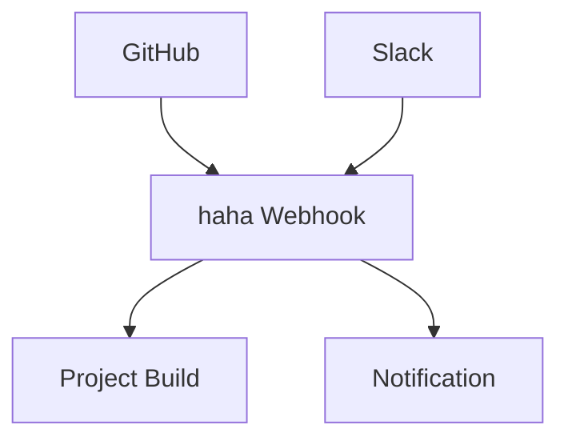

## Overview

Understand these core concepts to effectively manage your documentation in haha. You organize content into spaces and projects, integrate version control for collaboration, set permissions for team access, and connect with external tools via integration points. Master these to streamline your workflows.

<Columns cols={2}>
  <Card title="Spaces & Projects" icon="folder" href="#spaces-projects">
    Group your documentation logically.
  </Card>
  <Card title="Version Control" icon="git-branch" href="#version-control">
    Track changes like Git.
  </Card>
  <Card title="Permissions" icon="shield" href="#permissions">
    Control who sees and edits.
  </Card>
  <Card title="Integrations" icon="plug" href="#integrations">
    Connect to your tools.
  </Card>
</Columns>

## Documentation Spaces and Projects

You create **spaces** as top-level containers for related documentation sets, such as product guides or API references. Within spaces, you build **projects** to manage specific documentation workflows, like a changelog or user manual.

<Tabs>
  <Tab title="Spaces" icon="globe">
    Spaces provide isolation and branding. Assign a unique URL like `https://docs.haha.com/your-space`.

    <Callout kind="tip">
      Use spaces for multi-product documentation.
    </Callout>
  </Tab>
  <Tab title="Projects" icon="package">
    Projects handle versioned content within a space. Link them to Git repositories for automatic syncs.
  </Tab>
</Tabs>

## Version Control Basics

haha integrates Git-based version control. You connect repositories to projects, enabling pull requests, branches, and merges directly in the platform.

<Steps>
  <Step title="Connect Repository" icon="git-branch">
    In your project settings, paste the GitHub or GitLab repo URL: `https://github.com/your-org/haha-docs.git`.
  </Step>
  <Step title="Configure Branch" icon="git-pull-request">
    Set the default branch to `main` or `develop`.
  </Step>
  <Step title="Sync Changes" icon="refresh-cw">
    Push updates to trigger automatic builds and deployments.
  </Step>
</Steps>

<CodeGroup tabs="GitHub, GitLab">
  ```bash
  # Add remote and push
  git remote add haha https://github.com/your-org/haha-docs.git
  git push haha main
  ```
  ```bash
  # GitLab webhook setup
  curl -X POST https://gitlab.com/api/v4/projects/123456/webhooks \\
    -H "PRIVATE-TOKEN: your-token-here" \\
    -d "url=https://docs.haha.com/webhook/your-project"
  ```
</CodeGroup>

## Access Permissions

Control access with role-based permissions. Assign roles at space or project level.

| Role       | Read | Write | Admin |
|------------|------|-------|-------|
| Viewer     | ✅   | ❌    | ❌    |
| Editor     | ✅   | ✅    | ❌    |
| Owner      | ✅   | ✅    | ✅    |

<ExpandableGroup>
  <Expandable title="Advanced Permissions" default-open="false">
    Use API to manage programmatically:

    ```javascript
    await fetch('https://api.haha.com/v1/spaces/{spaceId}/permissions', {
      method: 'POST',
      headers: { 'Authorization': 'Bearer YOUR_TOKEN' },
      body: JSON.stringify({ userId: '123', role: 'editor' })
    });
    ```

    Invite teams via email or SSO integration.
  </Expandable>
</ExpandableGroup>

<Callout kind="alert">
  Review permissions regularly to prevent unauthorized access.
</Callout>

## Integration Points

haha exposes webhooks and APIs for seamless connections.



Connect via REST API:

```javascript
// Publish a page
const response = await fetch('https://api.haha.com/v1/projects/{projectId}/pages', {
  method: 'POST',
  headers: {
    'Authorization': 'Bearer your-api-key-here',
    'Content-Type': 'application/json'
  },
  body: JSON.stringify({
    path: '/introduction',
    content: '# Welcome\nYour MDX content here.'
  })
});
```

These concepts form the foundation. Start by creating a space and connecting your repo to see immediate benefits.